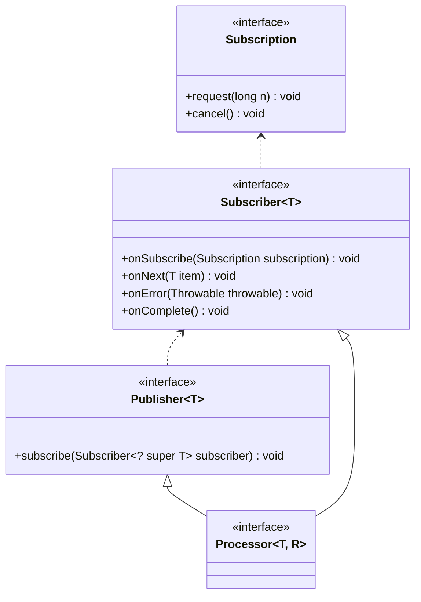

## 概念
> Reactive Stream (响应式流/反应流) 是JDK9引入的一套标准，是一套基于发布/订阅模式的数据处理规范。
> 响应式流从2013年开始，作为提供非阻塞背压的异步流处理标准的倡议。它旨在解决处理元素流的问题——如何将元素流从发布者传递到订阅者，
> 而不需要发布者阻塞，或订阅者有无限制的缓冲区或丢弃。
> 更确切地说，Reactive流目的是“找到最小的一组接口，方法和协议，用来描述必要的操作和实体以实现这样的目标：以非阻塞背压方式实现数据的异步流”。
> 
> [摘自CSDN](https://blog.csdn.net/qq_34285557/article/details/104569122){:target="_blank"}


响应式流规范定义了如下四个接口

|接口|作用|
|:---|:---|
|Publisher|消息发布者|
|Subscriber|消息订阅者|
|Subscription|发布者和订阅者连接方法|
|Processor|处理器|



## 综合示例

```java
public class ReactiveStreamSpec {
    public static void main(String[] args) throws InterruptedException {
        // 生产50个数字
        SubmissionPublisher<Integer> producer = new SubmissionPublisher<>();
        producer.subscribe(new BinaryProcessor());
        IntStream.range(0, 50).forEach(producer::submit);
        // 生产完成
        producer.close();
        TimeUnit.SECONDS.sleep(3);
    }

    // 数字转二进制字符串处理器
    static class BinaryProcessor extends SubmissionPublisher<String> implements Flow.Processor<Integer, String> {
        Flow.Subscription subscription;

        public BinaryProcessor() {
            super();
            super.subscribe(new BinarySubscriber());
            super.subscribe(new LimitedBinarySubscriber());
        }

        @Override
        public void onSubscribe(Flow.Subscription subscription) {
            this.subscription = subscription;
            this.subscription.request(1L);
        }

        @Override
        public void onNext(Integer item) {
            System.out.printf("on next in binary processor %d \n", item);
            this.subscription.request(1L);

            super.submit(Integer.toBinaryString(item));
        }

        @Override
        public void onError(Throwable throwable) {
            System.out.println(throwable.getMessage());
            throwable.printStackTrace();
        }

        @Override
        public void onComplete() {
            System.out.println("binary processor complete");
            // 触发消费完成
            this.close();
        }
    }

    // 数量限制消费者
    static class LimitedBinarySubscriber extends BinarySubscriber {
        AtomicInteger counter = new AtomicInteger();

        @Override
        public void onNext(String item) {
            counter.getAndAdd(1);
            System.out.printf("on next in limited binary subscriber %s\n", item);
            if (counter.get() >= 5) {
                super.subscription.cancel();
            }
            this.subscription.request(1L);
        }

        @Override
        public void onComplete() {
            System.out.println("odd binary subscriber complete");
        }
    }

    // 二进制数字字符串消费者
    static class BinarySubscriber implements Flow.Subscriber<String> {
        Flow.Subscription subscription;

        @Override
        public void onSubscribe(Flow.Subscription subscription) {
            this.subscription = subscription;
            this.subscription.request(1L);
        }

        @Override
        public void onNext(String item) {
            System.out.printf("on next in binary subscriber %s\n", item);
            this.subscription.request(1L);
        }

        @Override
        public void onError(Throwable throwable) {
            System.out.println(throwable.getMessage());
            throwable.printStackTrace();
            this.subscription.cancel();
        }

        @Override
        public void onComplete() {
            System.out.println("binary subscriber complete");
        }
    }
}
```